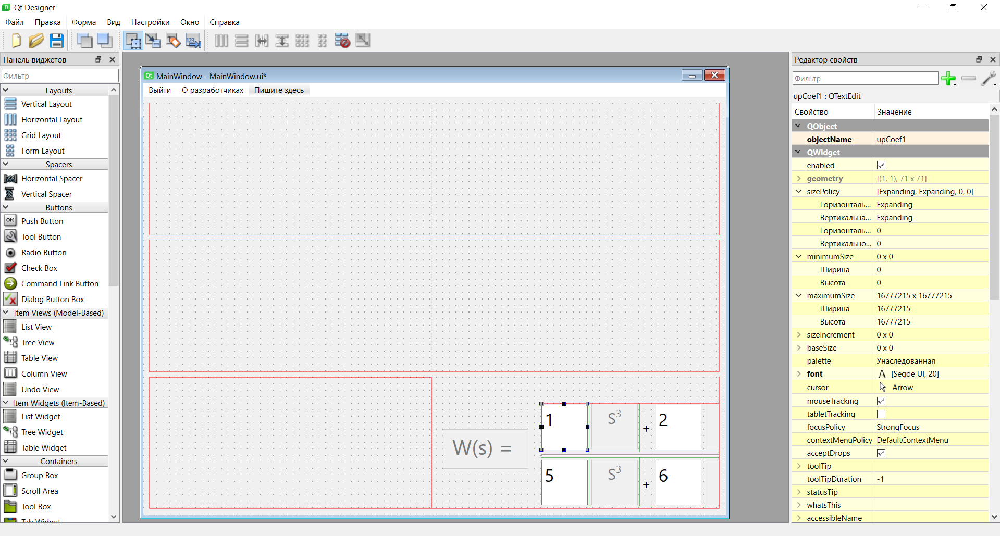
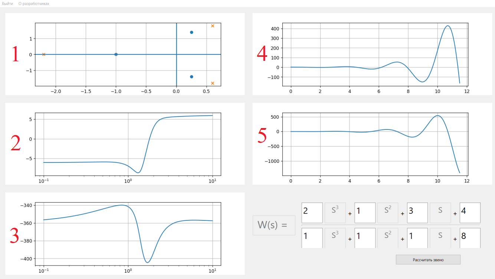

**Цель создания приложения**

Цель создания приложения -- обеспечить пользователям простой
инструментарий для анализа звеньев с помощью задания его передаточной
функции.

**Требования к приложению**

**Приложение должно по полученной от пользователя функции получать
четыре характеристики звена:**

1.  **Переходную характеристику;**

2.  **Амплитудно-частотную характеристику**

3.  **Фазово-частотную характеристику;**

4.  **Корневую картину.**

Переходная характеристика(h(t)) -- реакция звена на подачу на его вход
единичного воздействия(1(t)).

Амплитудно-частотная характеристика -- зависимость отношения амплитуд
входного и выходного сигналов от частоты.

Фазово-частотная характеристика -- зависимость фазового сдвига выходного
сигнала относительно входного от частоты сигнала.

Корневая картина -- изображения корней переходной функции на комплексной
плоскости. Корни числителя называются нулями, а корни знаменателя --
полюсами.

**Приложение должно быть кроссплатформенным.**

С целью обеспечения данного критерия приложение будет написано с
использованием Qt. Также с учетом использования математических
вычислений программа будет реализована на языке программирования Python.

**Целевая аудитория**

Приложение нацелено на студентов и инженеров АСУ ТП, для быстрого и
легкого получения характеристик звеньев.

#  Построение графика переходного процесса.

Переходный процесс -- зависимости сигнала на выходе системы,
характеризованной какой-то передаточной функцией, при подаче на её вход
ступенчатой функции(1(t)).

В ТАУ передаточная функция показ

ывает, как сигнал на выходе звена изменяется относительно сигнала на
входе. Передаточная функция записывается как показано в формуле.

$$\begin{matrix}
W(s) = \frac{b_{0}s^{n} + b_{1}s^{n - 1} + \ldots + b_{n}}{a_{0}s^{m} + a_{1}s^{m - 1} + \ldots + a_{m}};m > n\\
\end{matrix}$$

Для перехода от s-оператора к времени используется обратное
преобразование Лапласа, которое представлено в формуле.

$$\begin{matrix}
f(t) = \ \frac{1}{2\pi i}\int_{\alpha - iT}^{\alpha - iT}{e^{st}F(s)ds} \\
\end{matrix}$$

Данное вычисление переходного процесса является сложным в реализации,
поэтому было принято решение использовать сторонние библиотеки, которые
выполняют преобразование внутри себя.

Для построения переходного процесса была использована библиотека
python-control, которая позволяет моделировать звенья с заданной
передаточной функцией.

Таким образом был реализован метод, который получает на вход
коэффициенты числителя и знаменателя передаточной функции и график, на
котором необходимо построить данную зависимость. По заданным
коэффициентам формируется передаточная функция, и далее моделируется её
реакция на ступенчатое воздействие.

# Построение корневой картины.

Корневая картина для звена в ТАУ является изображением корней числителя
и знаменателя на комплексной плоскости. Принято полюса знаменателя
обозначать крестиками, а полюса числителя -- нолями.

Таким образом, для получения корневой картины было необходимо найти
корни полинома числителя и знаменателя и обозначить их на комплексной
плоскости. Для нахождения корней полиномов была использована библиотека
NumPy.

Для правильного отображения корней, близких к нулю было добавлено
допустимое отклонение.

# Построение частотных характеристик.

При построении частотных характеристик специалисты по ТАУ используют
частоту в логарифмическом масштабе, чтобы показать весь обширный
диапазон рабочих частот звена на одном графике.

Для построения ЧХ была так же использована библиотека python-control,
которая моделировала работу звена и получала списки значений амплитуды и
фазового сдвига на данной частоте. Программа, выполняющая данные
вычисления представлена на листинге 3.

# Построение весовой характеристики.

Также в ходе выполнения работы было принято решение дополнительно
реализовать возможность построения весовой характеристики звена.

Весовая характеристика -- зависимости сигнала на выходе системы при
подаче на её вход единичного импульса.

Вычисление данной зависимости схоже с вычислением переходного процесса.
Разница в том, что в данном случае на вход системы вместо ступенчатой
функции подается единичный импульс.

Данная задача была так же решена с помощью библиотеки python-control.

# Разработка пользовательского интерфейса

При выполнении работы использовались средства разработки Qt Designer.
Qt Designer - среда для разработки интерфейсов для программ, использующих библиотеку Qt. Разработка интерфейса происходила следующим образом. Слева находится панель инструментов, которые предоставляет приложение. В центре пространство для расстановки всех элементов и проектирования приложения. Справа -
редактор свойств элементов.

В результате был создан следующий интерфейс:

В правом нижнем пространстве пользователю предоставляется возможность
ввести звено, там же и находится кнопка «Рассчитать звено». По нажатию
этой кнопки появляются 5 графиков:

1)  Корневая картина звена

2)  Логарифмическая амплитудная характеристика

3)  Логарифмическая частотная характеристика

4)  Переходная характеристика

5)  Весовая характеристика